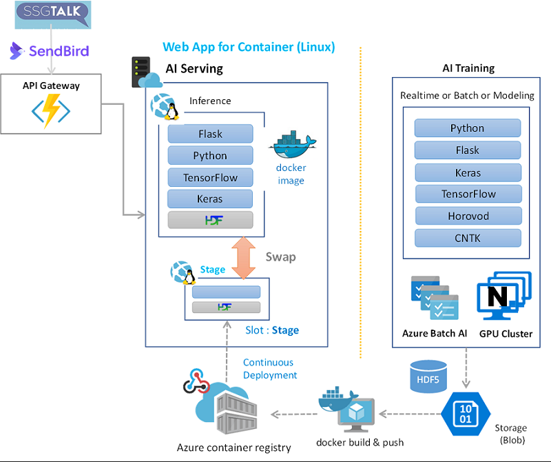
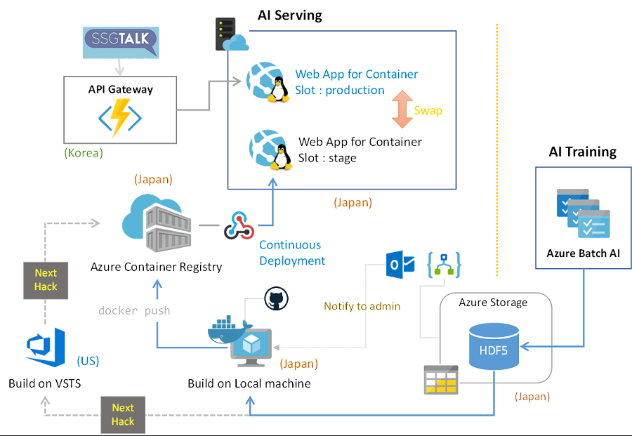
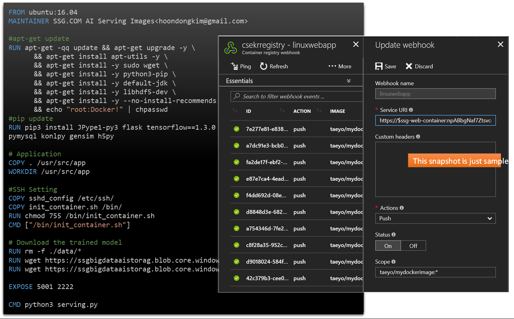
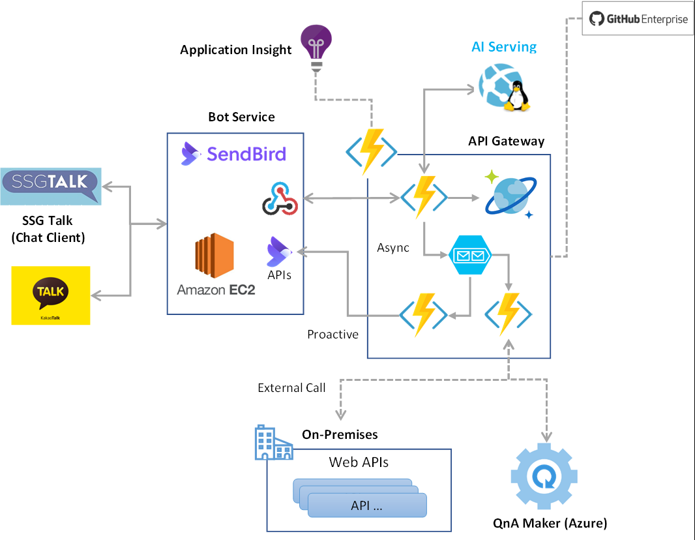
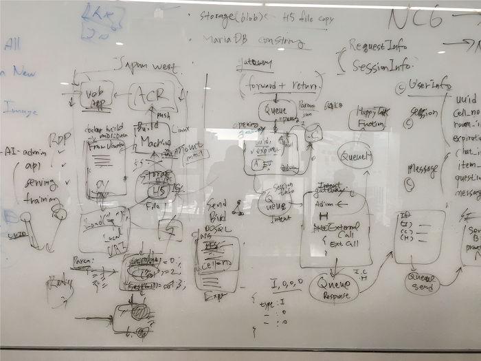
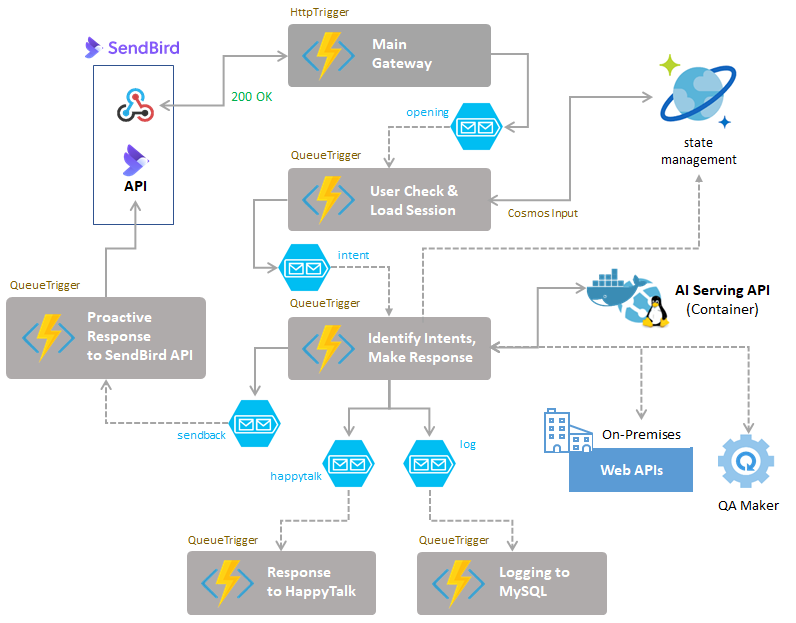

# SSG AI Chatbot with Deep Learning Hack

## Key technologies
The technologies outlined and included in this solution are:
- Azure Batch and Batch AI to train deep learning training 
- Azure Logic App to notify changes of trained model 
- Web App for Container on Linux to host AI inference Service
- Private container registry using Azure Container Registry.
- Continuous deployment using Container WebHook from Azure Container Registry to Web App for Container  
- Deployment Slot for staging/production environments swap in Web App for Container
- Azure Functions to host API Gateway(customer's Chatbot) with Serverless Architecture
- Continuous deployment with Github Private Repository
- Cosmos DB (SQL) for managing state of end users
- Azure Storage Queue for Reactive communication between Azure Functions
- Application Insight to monitor performance and usage of API gateway

## Core Team
The team was comprised of members from SSG AI team and Microsoft CSE:
- Hoondong Kim
- Hun Choi
- .
- .

## Partner profile
Shinsegae is The largest retailer in South Korea with E-Mart(160 stores across the country), Shinsegae department stores, TRADERS as their subsidiary. Also, SSG.COM, integrated e-commerce service for their subsidiaries’ e-commerce site, growing fast ($800M revenue, 37.6% YoY growth in CY16)  …  

## Problem statement

고객은 기존의 모든 서비스를 Azure의 VM 상에서 서비스를 테스트를 하고 있었는데, 크게는 총 4개의 영역으로서, 각각 AI Traing 영역과 AI Serving(Inference) 영역, API Gateway(Chatbot App) 영역, Admin Management Web 영역으로 나누어져 있었다. 모든 서비스들이 현재 VM에서 운영되고 있는데 추후 규모가 커질 경우 관리해야 할 VM의 수가 늘어날 수 있다는 부분이 우려스러웠으며, AI Training 서비스의 경우 상시 운영해야 할 이유도 없는데 GPU가 지원되는 VM을 계속 사용해야만 하는 상황이 부담스러웠다. 해서, 고객은 가급적 모든 서비스를 Managed Service 환경, 즉 PaaS 환경으로 새로이 아키텍처를 변경하고 싶어했으며, AI Serving 영역의 경우는 사전 테스트를 통해서 굳이 GPU가 필요하지 않다는 결론에 도출하여 이 기회에 Azure App Service를 적용하고 Web App의 수많은 훌륭한 기능들(자동 배포, 배포 슬롯 등)을 활용하고 싶어했다. 또한, Chatbot App에 해당하는 API Gateway 영역 역시 마이크로서비스나 서버리스 아키텍처를 도입해서 개발자들이 개별 로직에만 집중할 수 있도록 개선하고 싶어했다. 더불어, 기존에는 모든 서비스로 앱을 배포하는 부분이 수동으로 이루어지고 있었는데 이러한 반복 배포 작업이 비효율적이기에 이번 핵페스트를 통해서 가능한 한 많은 부분에 Continuous Deployment가 가능한지를 검증하기 원했다. 기존의 고객사 아키텍처는 대략 다음과 같다.

<기존 아키텍처>

## Requirements and goals
For this technical engagement, we defined these milestones before the hackfest:
	
- Customer doesn’t want to worry about Infra and VMs anymore
- Customer wants flexible and scalable Architecture
- Customer wants C/D strategy and easy maintenance
- Customer want to analysis call logs and have visibility

## Technical Delivery

## Architectural Decisions & Solutions

각각의 기술 영역에 대해서 고객과 MS 엔지니어들은 다음과 같은 설계를 결정하였다.

### AI Model Traininig Layer
이하 내용 추가

### **AI Inference(& Serving) Layer**

#### As-Is 

AI Serving Layer는 AI inference 역할을 수행하는 웹 서비스로, 기존에는 Python 언어로 개발되어 있었으며, DSVM의 Ubuntu 머신 내 Flask 웹 서버 상에서 운영 중에 있었습니다(개발환경은 jupyter 노트북을 사용). 사용하는 라이브러리는 tensorflow(1.3.0), keras(2.0.8), python-twitter 등 입니다.

#### What they want

기존 운영 방식은 별도의 Single VM에서 Model(.H5) 바이너리 파일(Deep Learning 서비스를 통해서 Trained 된 모델)을 h5py 라이브러리를 사용하여 메모리에 통채로 올려서 서비스를 제공하는 방식이었기에, 기본적으로 구동시키는 데에 메모리를 최소 2G(trained model의 size가 약 1.7G) 이상 소비하는 구조로 되어 있었습니다. 기존의 아키텍처는 이를 1대의 DSVM에서 운영하도록 설계가 되어 있었습니다만(일종의 검증 상황이었기에 AV SET 없이 Single VM으로 운영), 실제로 운영을 위해서는 고객은 아키텍처를 다시 설계하여 보다 나은 구조가 필요하다고 판단하였습니다.

해서, 아키텍처에 대해 논의하던 중, 고객은 자체적으로 사전에 성능 테스트를 수행하였고 그 결과 그들이 개발한 AI Serving Layer는 GPU보다는 CPU 환경에서 더욱 빠르게 동작한다는 결론을 얻었습니다(하단의 Refer 참고) 그렇기에 GPU VM을 사용하는 시나리오에서 벗어나 Azure PaaS(App Service) 환경을 사용하여 관리 편의성과 Scalability, Flexability를 얻는 쪽의 아키텍처를 검토하게 되었습니다.

> Refer to [Experiment and Performance Test for Deep Learning Inference & Serving : > GPU vs CPU (Korean)](http://hoondongkim.blogspot.jp/2017/12/deep-learning-inference-serving.html)
>   - blog post by Hoondong Kim(SSG Chief Dev, AI Data platform team) 
>-Topic : Is GPU really better than CPU in AI Inference?
>   - Conclusion : CPU is better than GPU in their cases.


#### Analysis and Design 

Envisioning Plan 미팅 시에 나왔던 방안은 Web App(Windows)의 KUDU(SCM) 환경에서 필요한 python 라이브러리들을 미리 Web App에 설치하고 Web App 환경이 주는 수많은 혜택들(Continuous Deployment, Auto Scale, Deployment Slot, App Service Environment etc)을 활용하고자 하였으나, 개발에 사용된 라이브러리들이 모두 Linux 기반의 라이브러리들이기에 가급적이면 OS로 Linux를 사용하는 것이 바람직하다는 의견이 제시되었고, TWG - Compute 그룹과의 기술 미팅에서도 이 부분의 아키텍처는 Container 기반으로 가져가는 것이 좋아보인다는 의견이 제시되어 최종 아키텍처는 Web App for Container로 진행하기로 하였습니다(Web App for Container는 아직 Web App의 모든 features들이 가용하지는 않지만 고객사에서 요구한 배포 슬롯과 C/D은 사용 가능하기에 적합한 시나리오로 채택되었습니다). 이를 통해 설계된 아키텍처는 다음과 같습니다.



다만, 이번 핵페스트에서는 VSTS를 활용한 Docker build, Push의 자동화는 배제하기로 하였는데, 이는 고객사의 QA 정책과 관련하여 이슈들(Test 및 QA 관련 이슈)이 발생할 가능성이 있어서, 별도의 Docker Build 머신(VM)에서 로컬 테스트를 수행한 다음에 수동으로 ACR에 Push를 하는 것으로 고객과 협의하였습니다.

#### Continuous Deployment Scenario

핵페스트에 앞서, TE는 약 2-3일에 걸쳐 시나리오의 가능성을 사전 검토했으며, 실제 핵페스트 기간 중에는 2일간 고객과 함께 기존 시스템을 Container 기반으로 재구축하여 Web App for Container에서 구동시키는 데 성공했습니다. Docker Images를 위한 Private Registry로는 Web App for Container와 같은 Region에 있는 Azure Container Registry를 사용했으며, Registry Webhook을 설정하여 새로운 Docker Image 가 Push되면, 자동으로 Web App의 Stage Slot에 배포되도록 하였습니다. 그리고, 배포가 완료되면 고객의 담당자가 각 Slot의 상태를 체크한 뒤에, Swap을 수동으로 진행하게 됩니다. 이렇게 정의된 CD 시나리오는 다음과 같습니다.



다음의 스냅샷은 dockerfile과 webhook을 통해 자동 배포가 수행된 이력을 보여줍니다(다만, 보안적인 이유로 Webhook 스냅샷은 실제 고객사의 것이 아니며, 사전 테스트 중에 수행했던 것을 대체하여 보여주고 있음을 밝힙니다. 하지만, 실제와 거의 동일합니다)



#### Considering the Region

게이트웨이의 역할이자, 챗봇 앱에 해당하는 Web API Gateway(chatbot)는 한국에서 서비스되고 있는데, AI Serving Layer(AI service like LUIS)는 Japan region에서 Web app for Container로 서비스하는 이유는 한국에는 아직 ACR이 제공되지 않기 때문입니다(ACR과 Web App for Container는 동일 Region에 있어야 비용 및 배포 시간이 절약됩니다). 만일, ACR을 한국에서 생성할 수 있었다면 더욱 빠른 Latency를 얻을 수 있었을 것입니다. 고객도 추후 한국에서 ACR이 서비스 된다면, 현재 AI Serving Layer와 관계된 모든 서비스(ACR, Web App for Container, Blob Storage for H5 model files etc)를 한국으로 옮길 의사가 있다고 하였습니다.

#### Issues and Workaround

기존 모듈을 Managed Service 환경으로 옮기면서 겪었던 몇가지 문제 중에 하나는 현재 고객이 Python으로 개발한 AI Inference 서비스의 구조가 약 1.7G의 모델 파일을 Flask 웹 서버가 시작하는 시점에 모두 메모리로 로드하여 서비스하는 구조이다 보니, WebApp이 처음 시작하는데 약 4분~5분 정도의 초기 로딩타임이 걸린다는 문제가 있습니다. 그런데, Web App for Container는 기본적으로 초기 시작 시간의 Limit이 230 seconds이기에, 고객사의 모듈을 올바로 시작할 수 없는 문제가 있었으며, 다음과 같은 Container Log가 계속해서 남는 것을 확인했습니다. 

```python
ERROR - Container site *****  did not start within expected time limit
```

고객사의 모듈이 최소 240~300 sec 이상의 시작 시간을 요구하기에 발생하는 문제였습니다. 이를 해결하기 위해서는 Web App의 App Settings에 **WEBSITES_CONTAINER_START_TIME_LIMIT**을 최대치인 **600** 초로 설정하여 올바로 로딩을 완료할 수 있었습니다.

#### What customer consider for better performance

그러나, 이러한 모델은 앞으로도 계속 커질 가능성이 있으며, 이는 결국 언젠가는 올바로 로딩할 수 없는 상황을 접하게 될 가능성이 높습니다. 더불어, 현재에도 배포와 SWAP 시 초기 로딩에 너무 많은 시간을 요구되는 것은 큰 문제입니다. 해서, 이러한 이슈는 애플리케이션을 튜닝(혹은 개발 변경)하여 기술적으로 개선할 필요가 있습니다. 고객은 이에 대한 고민을 시작할 것임을 시사했습니다. 

덧붙여, 현재 작성된 dockerfile에서는 이미지 빌드 시에 필요한 Model 파일들을 모두 wget으로 로컬 경로로 복사한 뒤, 이미지로 빌드하고 있습니다. 이는 고객이 사용하는 h5py 라이브러리가 로컬 경로의 파일만 로드할 수 있다는 제약이 있기 때문인데요. 이 부분을 개선하여 Python에서 직접 Remote Location(Blob Storage)에 있는 h5 파일을 로드할 수 있도록 변경한다면, 혹은 다른 라이브러리를 사용해서 동일한 기능을 제공하도록 개선할 수 있다면 Docker  이미지 안에 모델 바이너리를 포함하지 않아도 되기에 빌드되는 이미지 크기와 Push 시에 업로드되는 크기도 현재하게 줄일 수 있을 것으로 예상됩니다.  그리고, 이를 해결한다면 앞서 초기 로딩에 많은 시간이 들어가는 문제도 같이 해결이 가능할 것으로 보입니다.

#### Customer feedback

Web App for Container의 Deployment Slot 간의 SWAP 시간이 너무 느립니다. Production과 Stage 모두가 올바로 동작하는 것을 확인하고 Swap을 진행하면, 이미 두 Web App이 모두 운영 상황에 있음에도 불구하고, 새로운 이미지를 다시 로드하는 수준의 시간이 걸린  뒤에 교체가 이루어집니다. Swap과 관련된 부분은 Microsoft의 담당 팀에서 개선이 필요하다고 생각합니다


### API Gateway(Chatbot App) Layer
#### As-Is
API Gateway는 사실상 Chatbot app의 역할을 수행하며, SenBird의 WebHook을 통해서 채팅 사용자가 입력한 모든 구문을 전달받는 API Gateway의 역할을 수행합니다. 기존에는 Python / Flask 기반으로 개발되어 있었으며, 별도의 VM 상에서 운영 중에 있었습니다(개발환경은 jupyter 노트북을 사용). 

#### What they want

고객은 이번 핵페스트를 통해서 Managed Service 환경으로 바꾸기를 원했고, 기존의 로직을 분석해서 가능하다면 깔끔하게 로직을 정리하면서 서버리스 아키텍처도 도입되기를 바랬습니다. 그를 통해, 좀 더 효율적이고 효과적으로 챗봇의 개별 로직에만 집중하면서 계속해서 개선해 나가고자 합니다.

#### Analysis and Design 

문제점
- API 호출이 하나의 큰 동기적인 호출로 구성되어 있다.
- 모든 요청은 전체 메서드를 모두 수행한다.
- 내부적으로 외부 API에 대한 호출이 수 차례 발생하고 그에 따라 분기되는 구조를 갖고 있다
- 세션 정보를 보관하기 위해서 Redis를 사용하고 있으며, 그를 지원하기 위한 코드를 직접 관리한다

기존의 로직을 개별적으로 모두 분석해 본 결과, 기존 Python 코드는 요청과 응답이 하나의 단일 Sync 호출로 이루어지는 구조였으며, 내부에서 다양한 condition에 따라 분기하는 로직을 가지고 있었습니다. 모든 사용자의 입력은 intent 분석을 위해서 AI Serving Layer을 호출하며, 얻어진 Intent에 따라 다양한 조건에 따라 로직이 분기되는 구조입니다. 그렇기에, 상황에 따라 로직이 Skip되는 경우도 있고, 상황에 따라서는 추가적으로 다른 API로의 외부 호출이 이루어져야 하는 경우도 있었습니다. 

더욱 안 좋은 점은 그러한 모든 처리가 논리적으로는 하나의 큰 단일 메서드 안에서 단일 쓰레드로 처리되는 비효율적인 구조였다는 것입니다. 해서, 이러한 아키텍처 구조를 Async하게 변경하는 것이 바람직하며, 그와 동시에 각각의 로직을 분리하여 서버리스 아키텍처로 혁신하기로 하였습니다. 각 로직 간의 통신은 큐를 통해서 진행하고 최종 응답 메세지는 비동기적으로 SendBird에 Proactive 메세지로 전송하도록 아키텍처를 변경하였습니다.

솔루션
- 가능한 한 모든 분기 로직은 개별 Function을 분리한다
- 모든 호출은 비동기로 처리한다.
- 사용자에 대한 응답도 비동기적으로 Proactive Massage를 통해서 응답한다
- 목적에 따라 다양한 큐를 활용하고 큐를 통해서 로직이 분기하도록 한다
- 사용자의 상태는 Finction의 Input/output Binding을 사용하여 Cosmos DB에 저장하도록 한다.	

그 결과 구성된 아키텍처는 다음과 같습니다.



#### Re-Design Control Flow and Code Blocks

이제 정의된 아키텍처에 따라 기존의 코드들을 분석하고, 재작성 가능 여부를 점검하는 과정이 필요합니다. 고객은 가능하다면 Python을 사용하고 싶어했지만, 아직 Azure Function에서는 Python이 Experimental로만 지원되는 상황이기에 좀 더 안정적인 언어를 선택해야 했습니다. 결과적으로 모든 기존 코드를 C#으로 마이그레이션 하는 데에 동의하였고, 개발 언어와 플랫폼이 변경됨에 따라 기존 Python 코드와 제어 흐름을 모두 분석할 필요가 있었습니다. 

고객사의 API Gateway 개발 담당자와 1일 동안 모든 로직을 분석하면서 Function 수준의 분리작업을 수행하였고, 기존에 Redis로 보관하던 사용자의 상태 정보는 Cosmos DB를 사용하여 안정성과 가용성을 높이도록 하였습니다. 로직을 분리하고 정리하면서 아키텍처는 더욱 간소화되었고 불필요한 기존 코드도 깔끔하게 정리되었습니다.



현재까지 개발된 API Gateway 로직들을 Function으로 분리한 아키텍처는 다음과 같습니다.



케이스에 따라 서로 다른 큐로 메세지를 전달하고, 각각의 분기되는 로직은 해당 큐에 메세지가 오는 경우에만 수행하도록 변경하였습니다. 이는 기존의 수 많은 if, else if를 사용한 경우보다 직관적이며 각각의 로직에만 집중해서 코드를 개선할 수 있는 이점이 있습니다. 이러한 작업을 통해서 기존의 flask, python으로 작성되어 있던 로직은 C#, Function app으로 100% migration 되었습니다. 기존의 코드 예는 다음과 같습니다.

### Admin management Web Layer
이하 내용 추가

## Business impact
이하 내용 추가

## Partner technical engagement feedback
이하 내용 추가

## Conclusion
이하 내용 추가

## Future possibilities
이하 내용 추가
