# SSG AI Chatbot with Deep Learning 

SSG.COM의 AI Data Platform 팀은 다양한 오픈소스를 사용하여 자체 AI ChatBot을 개발하여 서비스하고 있다. 하지만, 현재의 아키텍처가 효과적인 지에 대해 의구심이 있었고 Microsoft와 함께 더 나은 아키텍처를 얻어내기 위한 여정을 떠나고자 하였다. Deep Learning부터 Serverless까지 가능한 한 필요한 모든 영역을 이번 핵페스트를 통해서 검증한다.

## Key technologies

SSG.COM의 tb-be 아키텍처와 핵페스트에서 사용된 기술들은 다음과 같다.

- [Azure Batch and Batch AI](https://azure.microsoft.com/en-us/services/batch-ai/) : 딥러닝 모델 트레이닝을 위한 운영 환경
- [Azure Logic App](https://azure.microsoft.com/en-us/services/logic-apps/) : 트레이닝 모델이 변경되었음을 관리자에게 통지
- [Web App for Container on Linux](https://docs.microsoft.com/en-us/azure/app-service/containers/tutorial-custom-docker-image) :  AI inference 서비스의 호스팅 환경. 그 밖의 Python Dependency 가 있는 Web Service 의 경우도 이곳에서 Serving 되도록 구성하였음(이는 2018년 5월 현재 Azure Function이 Python Preview 단계 였기 때문임).
- [Azure Container Registry](https://azure.microsoft.com/en-us/services/container-registry/) : 사설 도커 이미지 저장소
- [Container WebHook](https://docs.microsoft.com/en-us/azure/container-registry/container-registry-webhook)을 사용하여 Azure Container Registry에서 Web App for Container로 [Continuous Deployment](https://docs.microsoft.com/en-us/azure/app-service/app-service-continuous-deployment) 적용
- [Deployment Slot](https://docs.microsoft.com/en-us/azure/app-service/web-sites-staged-publishing) : Web App for Container의 스테이징/운영 간에 전환(Swap)을 위해서 배포 슬롯을 사용
- [Azure Functions](https://azure.microsoft.com/en-us/services/functions/) : 고객의 API Gateway(Chatbot)을 위한 서버리스 플랫폼
- Continuous Deployment를 위해 [Github Private Repository](https://github.com/) 사용(업데이트 : 2018년 3월 github 를 VSTS 프로젝트로 이관하였음)
- [Cosmos DB (SQL)](https://docs.microsoft.com/en-us/azure/cosmos-db/introduction) : 채팅 사용자의 상태 저장소
- [Azure Storage Queue](https://azure.microsoft.com/en-us/services/storage/queues/) : Azure Function 간 통신 매개
- [Application Insight](https://azure.microsoft.com/en-us/services/application-insights/) : 게이트웨이의 성능과 사용 통계를 모니터링

## Core Team

팀은 SSG AI 데이터 플랫폼 팀과 Microsoft CSE의 엔지니어들로 구성되었다.

- SSG.COM
  - [김훈동](http://hoondongkim.blogspot.kr/) : 수석 개발자 / Deep Learnig, Batch AI
  - 류성 : 개발자 / Deep Learnig, Serverless
  - 서동훈 : 개발자 / Docker, Container
  - 전영규 : 개발자 / Python, Docker, Container
  - 서인석 : 개발자 / PHP, Web App
- Microsoft 
  - [김태영](https://github.com/taeyo) : TE / Architecture, Serverless, WebApp, Container, Code Migration etc
  - [최훈](https://github.com/Ogamja) : PM / Project Management
  - [크리스 올드](https://github.com/cauldnz) : TE Lead / Batch AI, Deep Learning, CNTK etc
  - 크릿 카무토 : TE / Batch AI, Deep Learning, CNTK etc

## Hackfest period

사전 워크샵: 2017년 12월 1일    
Hackfest : 2017년 12월 18일 ~ 22일 / 5 일간    

## Partner profile 

신세계 그룹은 대한민국을 대표하는 가장 큰 종합소매사업자이다. 신세계 그룹 산하의 계열사들을 통해 소매, 패션, 호텔업, 식음료, 인프라, 다목적 쇼핑몰 등 다양한 사업을 영위하고 있다.
신세계 그룹은 그 동안 이마트, 신세계백화점, 트레이더스, 신세계TV쇼핑 등에서 각자 운영되던 온라인 쇼핑몰을 통합한 SSG.COM이라는 통합 온라인 쇼핑몰 서비스를 2014년에 런칭했다. SSG.COM 서비스는 매년 30%가 넘는 초고속 성장을 하고 있으며 고객센터를 통해 하루에 20,000건에 달하는 고객 서비스 콜이 유입되고 있다. 

고객센터 운영비용 절감과 고객들에게 더 좋은 사용자 경험을 제공하기 위해 오픈소스 기술 기반의 인공지능 챗봇 서비스 개발 프로젝트를 2017년 중반에 착수했으며 2018년 상반기에 정식 출시를 계획하고 있다. (업데이트 : 2018년 3월 말 정식으로 Production 오픈 하였다.)

또한 경쟁사들이 자사의 e-commerce 서비스에 공격적으로 AI 기술을 접목시키고 있는 시장 상황에 대응하기 위해 이후 이 AI 챗봇 서비스를 통해 고객서비스 업무 이외에도 다양한 형태의 AI 기술을 추가하여 서비스를 제공할 예정이다(현재 SSG는 자연어 기반의 장보기 Bot 프로젝트를 2018년 5월 추가로 진행 중이다).

## Problem statement

고객은 현재 Deep Learning 기반의 AI Chatbot 서비스를 개발하고 있다. 현재는 시범적으로 모든 서비스를 Azure의 VM(GPU DSVM(Data Science VM)) 상에서 테스트를 하고 있다. 테스트되고 있는 서비스 영역은 총 4개의 영역으로서, 그들은 각각 AI Model Traing Layer와 AI Serving(Inference) Layer, API Gateway(Chatbot App) Layer, Admin Management Web Layer로 나누어져 있다. 모든 서비스들은 현재 Azure VM에서 테스트되고 있다.

IaaS 기반의 아키텍처는 추후 운영 규모가 커질 경우, 자연스럽게 관리해야 할 VM의 수가 늘어나게 되면서 Infra 관리 및 유지보수에 추가적인 리소스를 투입해야 하기에 효율적이지 않다고 판단했다. 그렇기에 가급적이면 IaaS를 사용하지 않는 아키텍처를 원했다. 또한, AI Model Training Layer의 경우 상시 운영해야 할 필요도 없는데 GPU가 지원되는 VM을 계속해서 사용해야만 하기에 비용적인 측면에서도 부담스러워했다. 해서, 고객은 가급적 모든 서비스를 Managed Service 환경, 즉 PaaS 환경을 활용하는 아키텍처로 변경하고 싶어했다.

또한, AI Inference Layer의 경우는 고객사 자체의 사전 테스트를 통해서 굳이 GPU가 필요하지 않다는 결론을 얻었으며, 이번 핵페스트에서는 가급적 Azure App Service를 적용하면서 Web App의 수많은 훌륭한 기능들(자동 배포, 배포 슬롯 등)을 활용하고 싶어했다.

> 비고 : Chatbot의 경우 Batch Inference 가 아닌, Realtime Online Inference 시나리오에 해당되며, Batch Size 가 1인 특수성이 있다. 이 경우의 CPU와 GPU 의 Inference 성능 차이를 실험한 결과는 이곳에 블로깅 되어있다. 
> 
> [miniBatch Deep Learning Realtime Inferece 성능 비교, CPU vs GPU](http://hoondongkim.blogspot.kr/2017/12/deep-learning-inference-serving.html)

더불어, Chatbot App에 해당하는 API Gateway 영역 역시 마이크로서비스나 서버리스 아키텍처를 도입해서 개발자들이 개별 로직에만 집중할 수 있도록 개선하고자 했다.

그리고, 모든 서비스에 대해서 전체적으로 배포 자동화를 도입하길 원했다. 기존에는 모든 서비스에 애플리케이션을 배포하는 부분이 수동으로 이루어지고 있었으며 이러한 반복 배포 작업이 비효율적이라고 판단했기에 이번 핵페스트를 통해서 가능한 한 많은 부분에 Continuous Deployment를 적용하기 원했다. 기존의 고객사 아키텍처는 대략 다음과 같다.

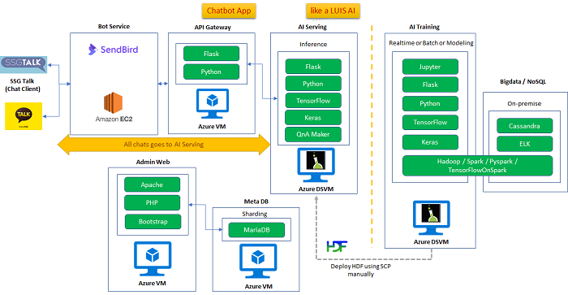

## Requirements and goals

이번 핵페스트를 진행하면서 사전에 정의한 요구사항과 목표는 다음과 같다.

- 각각의 서비스들은 가능하다면 PaaS 환경에서 운영하도록 설계한다. 
    > 업데이트 : 2018년 3월 말 오픈 시점, 100% Serverless FaaS(Function as a Service, Azure Function) 및 BaaS(Backend as a Service, Web App) 로 구성 오픈되었으며, Dev Zone 을 제외 하고는 Production Zone 의 경우 VM이 하나도 존재하지 않은 체로 오픈 되었다.
- 유연하고(flexible) 확장가능한(scalable) Architecture로 설계한다.
- AI Model Training은 Multi-Host, Multi-GPU를 활용하도록 설계한다.
- 배포가 빈번하게 발생하는 서비스 Layer에 대해서는 자동 배포(Continuous Deployment) 전략을 적용한다.
- 서버리스 아키텍처가 적용 가능한 서비스 Layer에는 그를 적용한다.
- 모든 요청/응답 데이터는 로그로 남겨서 차트 등을 통해서 가시적으로 살펴볼 수 있어야 한다.

## Sources Repository

고객사의 요청에 의해서 이번 핵페스트에서는 GitHub Private Repo를 사용한다. 각각의 서비스 Layer별로 전용 Repo를 구성하였으며 구성된 Repository의 모습은 다음과 같다

> 업데이트 : 오픈 시점에는 VSTS로 변경되었다

- total 4 Private Repos, one for each service layer 

    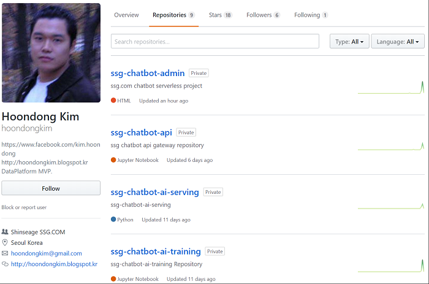

## Project Planning & Management

초기 고객 미팅에서부터 핵페스트 완료까지 1.5개월이 소요되었다. Envisioning 워크샵 이후 확보된 신세계 프로젝트팀의 요구사항과 1차 To-Be 아키텍쳐를 가지고 Microsoft CSE 엔지니어 커뮤니티인 Technical Pillar와 컨퍼런스 콜을 통해 아키텍쳐를 리뷰하고 논의하는 Game Plan 리뷰과정을 거쳤다. 이 과정을 통해 최종 아키텍쳐와 사용 기술에 대한 안을 확정했다. 

 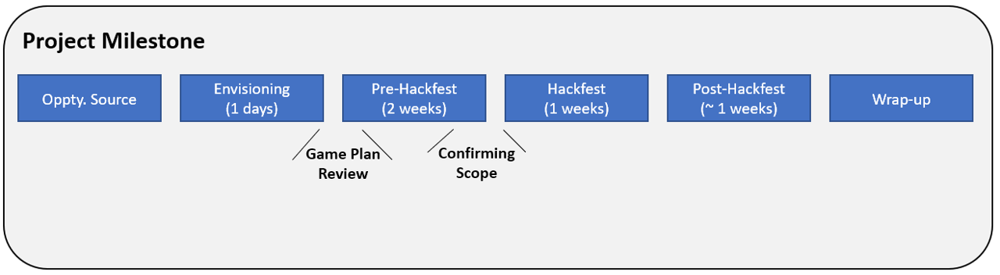

이번 SSG핵페스트의 백로그는 3개 Epic과 11개의 User Story, 28개 하위 태스크로 구성되었으며. 백로그 관리 도구로는 VSTS (Visual Studio Team Services)를 사용했다. VSTS의 경우 그 자체로 CI/CD 기능을 제공하고 DevOps 효율성을 향상시키는데 좋은 도구이지만 이번 Hackfest에서 Build/Release 자동화는 범위 밖에 있어 백로그 관리 용도로 제한적으로 사용했다. VSTS와 더불어 Hackfest에 참여한 개발자간의 협업도구로 Slack을 사용했다.

> 업데이트 : 프로젝트의 오픈 시점에는 VSTS를 도입하였다

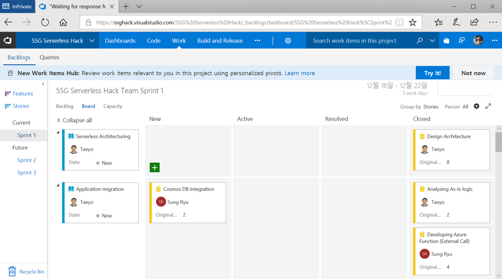 | 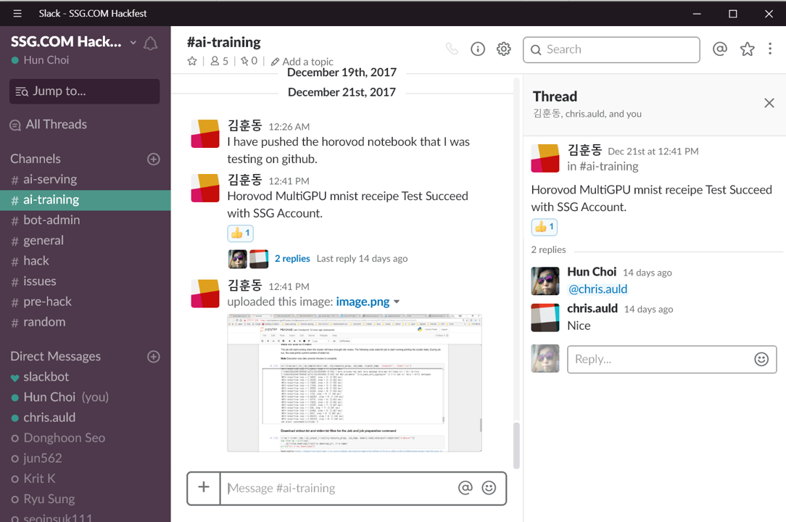

Hackfest 기간 동안 마이크로소프트와 신세계 프로젝트 개발자들은 매일 오전 15~20분간의 스탠드업(Stand-up) 미팅을 통해 작업 진척 상황과 Lessons & Learn을 서로 공유했다. 이 때 포스트잇을 사용한 칸반보드 (Kanban Board)를 사용했다. VSTS 또한 칸반보드 스타일의 작업 현황판을 제공하지만 작업 내용이 명시된 포스트잇을 개발자들이 각각 작업 진척 상황을 옮기는 행위가 제공하는 동기부여 효과를 위해 물리적 칸반보드를 병행해서 사용하였다.

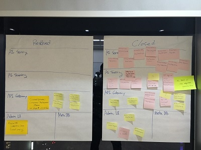 | 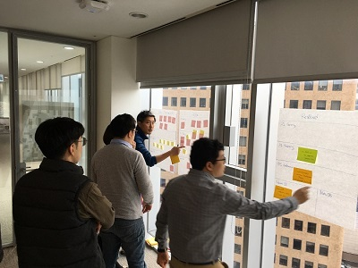


## Technical Delivery 

이번 핵페스트에서는 전체 Production 서비스를 이루고 있는 총 4개의 서비스 영역에 대해서 기존의 아키텍처를 분석하고 최적화된 to-be 아키텍처를 정의하였으며 또한, 각 영역의 담당 개발자들과 함께 각각의 서비스 영역에 대해 기술 검증 및 마이그레이션을 수행하였다. 이번 핵페스트에서 다루어진 서비스 Layer들은 다음과 같다.

1. AI Model Training Layer : Tenserflow와 keras를 사용하여 Deep Learning을 수행하는 레이어
2. AI Inference(& Serving) Layer : Python, Flask, keras를 사용하여 모델 데이터를 Web API로 서빙하는 레이어(이는 LUIS 즉, [Language Understanding Intelligent Service](https://www.luis.ai/)처럼 Intent 분석을 수행하는 서비스이다).
3. API Gateway(Chatbot App) Layer : Python, Flask 기반으로 ChatBot Application 역할을 수행하는 Web API 서비스. 채널 및 방 관리는 SendBird를 활용한다.
4. Admin Management WebSite Layer : PHP로 개발된 관리자용 웹 사이트. Intent나 Entity 관리 및 Realtime Training 호출 등의 작업을 수행할 수 있다.

### Proposed architecture

각각의 서비스에 대해서 기술적인 부분과 지역적인 고려, 고객의 요구사항들을 반영하여 정의된 최종 아키텍처는 다음과 같다.

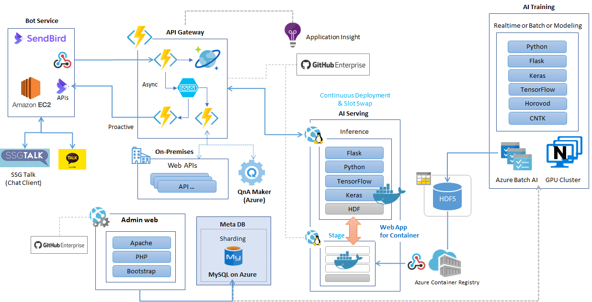

다만, 이러한 아키텍처를 위해서 사용해야 할 Azure Resource 중에는 아직 Korea Region에서 가용하지 않은 것들도 있기에, 고객 입장에서 성능적으로 가장 효과적이도록 지역적으로 배분하여 설계한 모습은 다음과 같다.

> 업데이트 : 2018년 3월 말 오픈 시점, Korea region 에 Azure Batch AI 를 제외한 모든 Azure Resource가 가용하게 되었기에 현재는 Korea Region 을 대부분 활용하고 있다.


## Architectural Decisions & Solutions

각각의 서비스 Layer에 대해서 고객과 MS 엔지니어들은 다음과 같이 설계하고 구현하였다.

----------------------

### **Layer 1 : AI Model Traininig Layer**

신세계는 기존 LSTM (Long-Short-Term-Model) 기반의 RNN 모델을 가지고 핵페스트를 했다. 이 모델은 효과적이기는 했으나 소요되는 시간과 효율성이 문제가 되었다. 고객은 다른 네트워크 아키텍쳐와 하이퍼파라미터를 가지고 실험하는 것 뿐만 아니라  모델을  좀 더 빈번하게 재트레이닝시키기 원했다. 
이번 핵페스트에서의 우리 목표는 기존 모델은 수정하지 않으면서 트레이닝 프로세스를 개선시키기위한 파이프라인을 구축하는 것이었다. 

이 새로운 파이프라인에서 구현하고자 하는 주요 사항은 아래와 같다; 
1. [Azure Low Priority VMs](https://azure.microsoft.com/en-gb/blog/announcing-public-preview-of-azure-batch-low-priority-vms/)들을 사용하여 비용 절감의 효과를 얻는다.
2. 멀티 GPU, 궁극적으로는 멀티 GPU를 장착한 멀티 머신에서 모델을 트레이닝 시킨다.(Multi Host + Multi GPU)
3. 기존 모델을 최대한 수정없이 그대로 둔다. 신세계 입장에서는 TensorFlow를 사용해서 모델을 계속 실행하고 [Keras](https://keras.io/)로 빌드하는 것이 중요했다.

Azure는 다양한 [GPU 장착 장비 타입](https://docs.microsoft.com/en-us/azure/virtual-machines/windows/sizes-gpu)을 제공한다. 우리는 주로 Kepler 기반의 K80 GPU를 장착한 NC 시리즈 머신을 가지고 작업했다. 핵페스트 이후 ND 시리즈가 정식 출시되었는데 이후 이 머신을 사용하는 것이 가장 적합할 것으로 예상된다. ND시리즈는 Pascal 기반의 P40 GPU 유닛을 제공한다. 이 유닛은 대용량 메모리 (24GB)를 가지고 있고 초고성능의 반정밀도 FLOPs를 지원하여 Deep Neural Network 트레이닝에 이상적이다. 근래 추세는 DNN 모델의 트레이닝과 인퍼런싱을 위해 반정밀도 연산을 사용하는 쪽으로 움직이고 있으며 이는 주요 프레임웍들을 통해 지원되고 있다. (*Courbariaux et al. Training deep neral networks with low precision multiplications. 2015.* [arXiv:1412.7024](https://arxiv.org/abs/1412.7024) 참조)

Azure N 시리즈 인스턴스는 최대 4개의 GPU를 지원한다. 멀티 노드에 걸쳐 트레이닝시키기 위해서 고성능의 네트워킹 상호연결이 필요한데, NC24r 혹은 ND24r 인스턴스들은 고성능 [RDMA를 지원하는](https://docs.microsoft.com/en-us/azure/virtual-machines/windows/sizes-hpc#rdma-capable-instances) 2차 네트워킹을 장착하고 있다. 고성능 네트워크가 필요한 이유는 DNN 트레이닝에 있어 그 확장성의 제한은 노드들 간의 (실제로는 각각의 GPU간에) 가중치 데이터들의 전송속도에 달려 있기 때문이다. 

#### 아키텍쳐 고려사항
우리는 파이프라인을 구현하는데 있어 아래와 같은 몇가지 아키텍처를 고려했다.

	• Hadoop + Spark + BigDL
	• Hadoop + Spark + TensorFlowOnSpark
	• Azure Batch AI + TensorFlow + Keras + Horovod

상기 옵션들에 대한 자세한 논의와 각각의 장단점에 대해서는 아래 포스팅을 참고하기 바란다. 
[Deep Learning Multi Host & Multi GPU Architecture #1 - 고찰 및 구성 with tensorflow, cntk, keras, horovod, Azure Batch AI](http://hoondongkim.blogspot.jp/2018/01/deep-learning-multi-host-multi-gpu.html). (*이 포스팅은 한국어로 작성되어 있으니 영문으로 보기 위해서는 크롬 브라우저에서 번역 기능을 사용하는 것을 추천한다.*)  

신세계팀은 또한 Keras와 Horovod 스케일 아웃 방식의 성능 비교를 각각 수행해서 비교했다. [요약하자면](http://hoondongkim.blogspot.jp/2018/01/deep-learning-multi-host-multi-gpu_11.html), Keras의 weight 공유 방식은 단일 노드의 멀티 GPU 트레이닝에서 더 효율적이었으나 GPU를 최대 8개까지만 사용할 수 있다는 제한이 있었다. Azure N 시리즈 머신에서 최대로 사용할 수 있는 최대 GPU인 4개 GPU에서는 두 접근 방법 간의 델타는 크게 좁혀진다. 

#### Horovod를 사용한 멀티 GPU와 멀티 노드 트레이닝 
TensorFlow는 [분산 트레이닝](https://www.tensorflow.org/deploy/distributed)을 지원하지만 모델 트레이닝 프로그램에 대한 상당량의 수정이 요구된다. 이번 핵페스트 초기에 우리는 Uber에서 개발한 [Horovod](https://github.com/uber/horovod) 프레임웍으로 실험하는 걸로 결정했다. 

Horovod는 TensorFlow 트레이닝에 MPI 기반의 [작업 분산 패턴](https://www.tensorflow.org/deploy/distributed)을 적용한다. 초기 검토에서부터 이 방식은 상당히 명료한 방식으로 보였다. 또한 이는 이번 핵페스트의 중요한 성공 요소였던 [Keras를 지원](https://github.com/uber/horovod/blob/master/examples/keras_mnist.py)한다.

Horovod 는 7~8줄 정도의 코드 수정만으로, Multi Host 및 Multi GPU 를 전혀 고려하지 않고 작성된 Deep Learning 코드가 MPI를 매게로 하여 분산 병렬(Multi Host + Multi GPU) 수행될 수 있다. 그리고, 그 부분을 Elastic 하게 H/W Infra 적으로 PaaS 형태의 유연성을 제공하는 것이 Azure Batch AI 이다. 신세계에서는 Azure Batch AI + Horovod 를 구성하기에 앞서, TensorflowOnSpark 도 고려 및 실험해본 바 있었으나, Hadoop 및 Spark 등의 무거운 Cluster 의 dependecy 가 있어, 보다 유연하고 가벼운 구성으로 Horovod 를 더 선호하게 되었다.

#### Azure Batch AI를 통한 Simple GPU 클러스터 관리
우리 팀은 Azure에서 제공되는 [Azure Batch](https://azure.microsoft.com/en-us/services/batch/) HPC 서비스에 대한 많은 경험을 가지고 있었다. 또한 Batch를 통해 저비용의 우선순위가 낮은 VM에 액세스 할 수도 있다. 우리는 Batch 상단의 Docker 기반 레이어인 [Azure Batch Shipyard](https://github.com/Azure/batch-shipyard)를 사용하는 것을 고려했으나 결국 새로 출시된 [Azure Bach AI](https://azure.microsoft.com/en-us/blog/batch-ai-public-preview/) 서비스를 사용하기로 결정했다. 이 서비스는 이번 핵페스트 2달 전에 출시되었기 때문에 실제로 적용해보는건 모든 팀원들이 처음이었으나 Batch와 Batch Shipyard에 대한 기존 전문성과 경험이 이 서비스를 적용하는데 유용하게 작용했다. 


Batch AI는 Batch 서비스 내의 클러스터에 자동화된 방식으로 머신을 추가하고 분리할 수 있다. 이 머신들은 VM 또는 Docker 컨테이너 상에서 실행되는 다양한 ML 프레임웍을 사용할 수 있다. 우리는 linuxdsvmubuntu 이미지를 트레이닝에 사용했다. 좀 더 가벼운 이미지와 컨테이너의 조합으로 특히 클러스터를 시작하는데 있어 효율성 향상 효과를 얻을 수 있다. 또한 우리는 머신이 시작되는 동안 apt를 통해 MPI를 설치하고 PyPl로 Horovod를 설치하도록 했고 이는 향후 컨테이너 빌드시에 통합될 수 있을 것이다. 

만약 이 방식을 테스트해보고자 한다면 아래의 구성 작업을 [Batch AI TensorFlow GPU recipe](https://github.com/Azure/BatchAI/tree/master/recipes/TensorFlow/TensorFlow-GPU) 와 함께 사용해볼 것은 권장한다. 

```
parameters = models.job_create_parameters.JobCreateParameters(
     location=cfg.location,
     cluster=models.ResourceId(cluster.id),
     node_count=2,
     input_directories=input_directories,
     std_out_err_path_prefix=std_output_path_prefix,
     container_settings=models.ContainerSettings(
         models.ImageSourceRegistry(image='tensorflow/tensorflow:1.1.0-gpu')),
     job_preparation=models.JobPreparation(
         command_line="apt update; apt install mpi-default-dev mpi-default-bin -y; pip install horovod"),
     custom_toolkit_settings = models.CustomToolkitSettings(
         command_line='mpirun -mca btl_tcp_if_exclude docker0,lo --allow-run-as-root --hostfile $AZ_BATCHAI_MPI_HOST_FILE python $AZ_BATCHAI_INPUT_SCRIPTS/trainAll_simple_v2.py'))
```

----------------------

#### Customer Feedback

고객사의 기술 리더인 김훈동 Chief 리드는 전공이 Deep Learning이기에 이번 핵페스트에서 다루어본 CNTK와 Batch AI 기술에 대해 만족도가 대단히 높았다. Facebook과 Slack을 통해서 이번 핵페스트가 큰 도움이 되었음을 여러 차례 피력하였으며 또한, 자신이 경험한 기술적인 가치를 다른 데이터 개발자들에게 알리고 싶어했다. 해서, 그는 수 차례 블로그에 이번 핵페스트에서 다루었던 실험 내용들을 정리해서 다른 개발자들에게 공유하고 있다. 

Title : Deep Learning Multi Host & Multi GPU Architecture with tensorflow, cntk, keras, horovod, **Azure Batch AI**    
Link : http://hoondongkim.blogspot.kr/2018/01/deep-learning-multi-host-multi-gpu.html

Title : Deep Learning Multi Host & Multi GPU 성능 비교 on Azure Batch AI( Tensorflow + Keras + Horovod + Azure Batch AI )
Link : http://hoondongkim.blogspot.kr/2018/01/deep-learning-multi-host-multi-gpu_11.html

심지어는, 이러한 내용을 단계별로 정리하여 다음과 같은 제목으로 개발자 커뮤니티와 함께 Hands-On Lab을 진행하기도 하였다.

Title : Deep Learning with distributed GPU based on Azure Batch AI  
Link : https://onoffmix.com/event/123844

----------------------

### **Layer 2 : AI Inference(& Serving) Layer**

----------------------

#### As-Is

AI Serving Layer는 AI Inference 역할을 수행하는 웹 서비스로, 기존에는 Python 언어로 개발되어 있었으며, [Data Science Virtual Machine](https://azure.microsoft.com/en-us/services/virtual-machines/data-science-virtual-machines/)(OS는 Ubuntu) 머신 내 Flask Web server 상에서 운영 중에 있다(개발환경은 jupyter 노트북을 사용). 사용하는 라이브러리는 tensorflow(1.3.0), keras(2.0.8), python-twitter 등이다.

이 서비스는 역할적으로는 LUIS 즉, [Language Understanding Intelligent Service](https://www.luis.ai/)와 유사한 서비스이다. SSG.COM 데이터 플랫폼 팀에서 자체 개발한 AI Model Training Layer에서 trained된 Model(.H5) 바이너리 파일을 h5py 라이브러리를 사용하여 Flask 웹서버의 메모리에 올려서 LUIS 관련 서비스를 제공하다. 현재 주된 역할은 챗봇 사용자의 메시지에 대한 Intent와 Entity 등을 파악하는 것이지만, 이후로는 더 많은 역할을 수행하도록 계속해서 발전될 예정이다.

#### What customer want

기존 서비스는 기본적으로 구동시키는 데에 메모리를 최소 2G(trained model의 size가 약 1.7G) 이상 소비하는 구조로 되어 있다. 또한, GPU를 활용하는 것이 성능적으로 나을 것이라는 기대때문에 Data Science VM에서 운영하도록 설계가 되어 있다(일종의 검증 상황이었기에 Availability Set 없이 Single VM으로 운영). 하지만, 이는 최적의 운영 환경은 아닐 것이라고 생각하고 있으며, 더 나은 환경이 무엇인지 검증하고 싶어했다.

사전 기술 미팅 중에 우리는 층이 그리 깊지 않은 Deep Learning 모델은 CPU만으로도 만족할만한 성능을 얻을 수 있을 것 같다는 의견을 제시하였고, 고객은 이러한 의견에 동의하여 핵페스트 이전에 사전 성능 테스트를 통해서 그에 대한 결과를 확인하기로 하였다. 

테스트 결과, 그들이 개발한 AI Serving Layer는 GPU보다는 CPU 환경에서 더욱 빠르게 동작한다는 테스트 결과를 얻었다(하단의 Refer 참고). 그에 따라 고객은 GPU 기반의 VM을 사용하는 IaaS 시나리오에서 벗어나, PaaS(Azure App Service) 환경을 도입하길 원했으며, 이를 통해 안정성, 관리성 뿐만 아니라 유연한 개발 및 배포 환경을 확보하고자 하였다. Chatbot의 경우 실시간 Inference 이며, miniBatch size 가 1인 inference 이므로, 예상과 다르게 CPU가 GPU보다 성능이 더 좋았다. 

> Refer to [Experiment and Performance Test for Deep Learning Inference & Serving : > GPU vs CPU (Korean)](http://hoondongkim.blogspot.jp/2017/12/deep-learning-inference-serving.html) 
>   - blog post by Hoondong Kim(SSG Chief Dev, AI Data platform team)  
>   - Topic : Is GPU really better than CPU in AI Inference? 
>   - Conclusion : CPU is better than GPU in their cases. 

#### Analysis and Design 

Envisioning Plan 미팅 후에 검토되었던 방안은 Web App(Windows)의 KUDU(SCM) 환경에서 필요한 python 라이브러리들을 미리 Web App에 설치하고 Web App 환경이 주는 수많은 혜택들(Continuous Deployment, Auto Scale, Deployment Slot, App Service Environment etc)을 활용하고자 하였다. 하지만, 개발에 사용된 라이브러리들이 모두 Linux 기반의 라이브러리들이기에 가급적이면 OS로 Linux를 사용하는 것이 바람직하다는 의견이 제시되었고, TWG - Compute 그룹과의 기술 미팅에서도 이 부분의 아키텍처는 Container 기반으로 가져가는 것이 나아보인다는 의견이 제시되어 최종 아키텍처는 Web App for Container로 진행하기로 하였다(Web App for Container는 아직 Web App의 모든 features들을 제공하지는 않지만 고객사에서 원하는 배포 슬롯과 Continuous Deployment는 사용 가능하기에 적합한 시나리오로 채택되었음). 이를 통해 설계된 아키텍처는 다음과 같다.


다만, 이번 핵페스트에서는 VSTS(Visual Studio Team Service)를 활용한 Docker build, Push의 자동화는 배제하기로 하였다. 이는 고객사의 QA 정책과 관련된 이슈들(Test 및 QA 관련 이슈)이 발생할 가능성이 있어서이다. 해서, 별도의 전용 Docker Build 머신(VM)을 활용하여 로컬 테스트를 수행한 다음에 수동으로 Azure Container Registry에 Push 하는 것으로 협의하였다. (오픈 시점 VSTS로 이관 작업을 진행하였으며, 전체 자동화 이관은 여전히 진행 중이다.)

#### Continuous Deployment Scenario

핵페스트에 앞서, TE는 약 2-3일에 걸쳐 배포 시나리오를 여러 방향으로 사전 검토하였다. 실제 핵페스트 기간 중에는 2일간 고객과 함께 기존 시스템을 Container 기반으로 재구축하여 Web App for Container에서 구동시키는 데 성공했다. Docker Images를 위한 Private Registry로는 Web App for Container와 같은 Region에 있는 Azure Container Registry를 사용했으며, Registry Webhook을 설정하여 새로운 Docker Image가 Push되면, 자동으로 Web App의 Stage Slot에 배포되도록 하였다. 배포가 완료되면 고객의 담당자가 각 Slot의 상태를 체크한 뒤에 Swap을 수동으로 진행한다. 이렇게 정의된 Continuous Deployment 시나리오는 다음과 같다.


다음의 스냅샷은 Dockerfile의 코드와 Web App의 Azure Container Registry 설정 및 Webhook을 통해 자동 배포가 수행된 이력을 보여준다.

Azure Container Registry Settings

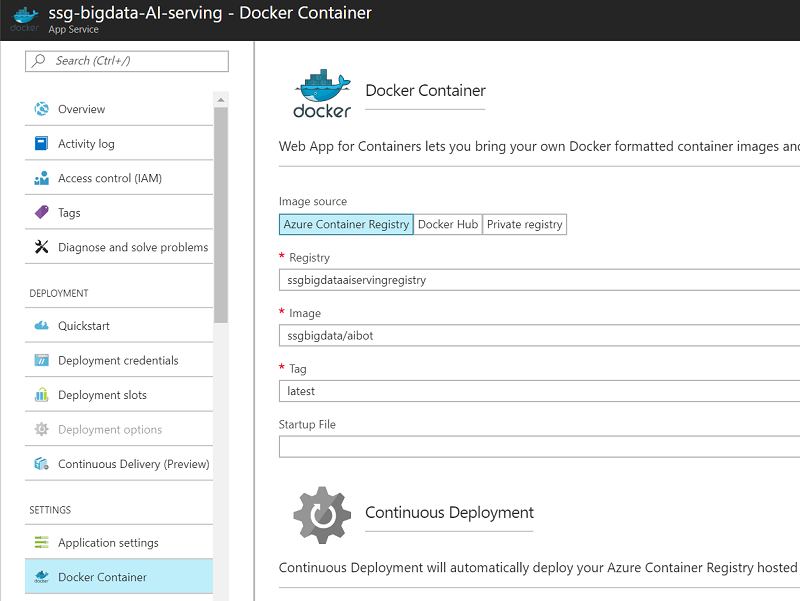

Dockerfile Example

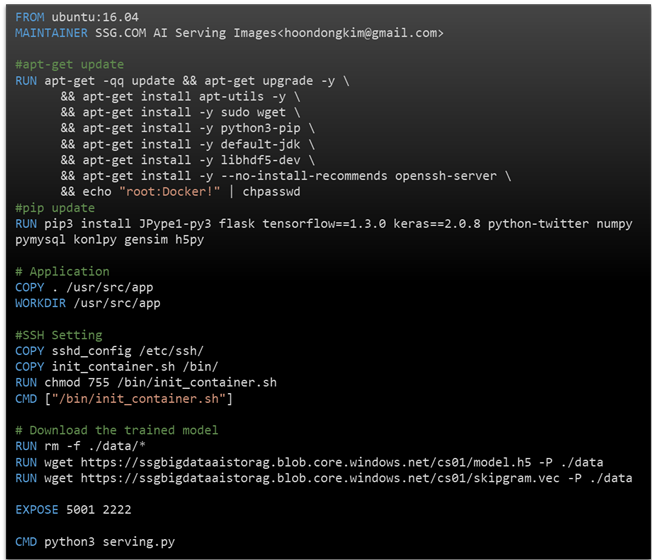

Push History via Container WebHook

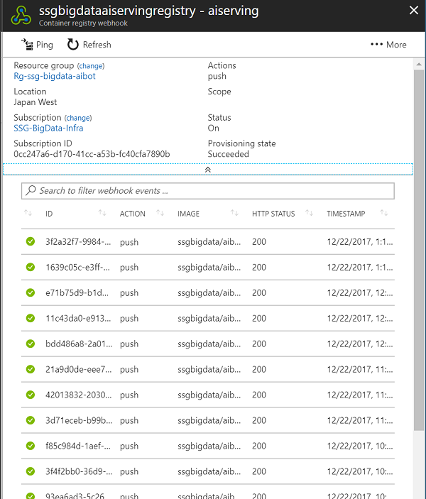

#### Considering the Region

게이트웨이의 역할이자, Chatbot App에 해당하는 Web API Gateway(chatbot) Layer는 한국에서 서비스되고 있는 반면, AI Serving/Inference Layer(AI service like LUIS)는 Japan region에서 Web app for Container로 서비스하고 있다. 그 이유는 한국에 아직 Azure Container Registry이 지원되지 않기 때문이다(Azure Container Registry과 Web App for Container는 동일 Region에 있어야 배포 비용 및 속도에 효율적이다). 만일, ACR(Azure Container Registry)을 한국에 생성할 수 있다면 더욱 빠른 Latency를 얻을 수 있을 것이다. 고객은 추후 한국에서 ACR이 서비스 된다면, 현재 AI Serving Layer와 관계된 모든 서비스(ACR, Web App for Container, Blob Storage for H5 model files etc)를 한국으로 옮길 계획이다.

> 업데이트 : 오픈 시점에 Korea Region 이 가용하여, 해당 서비스는 Korea Region에서 오픈하였다.

#### Issues and Workaround

기존 모듈을 Managed Service 환경으로 옮기면서 겪었던 몇 가지 문제 중 하나는 로딩 타임 제약과 관계된 것이다. 현재 고객이 Python으로 개발한 AI Inference 서비스의 동작 방식은 약 1.7G의 모델 파일을 Flask 웹 서버가 시작하는 시점에 모두 메모리로 로드하여 서비스하는 구조이다. 물론, 이러한 구조는 사실 개선 혹은 재설계가 필요한 부분이지만 그는 고객사에서 자체 개발 일정에 따라 추후 개선해야 하는 부분이며, 지금 변경할 수는 있는 부분이 아니기에 현재로서는 기존 개발된 상태의 모듈 그대로 서비스가 동작하게 해야 한다. 문제가 되는 부분은 기존에 개발된 Web App이 처음 시작하는데 약 4분~5분 정도의 초기 로딩타임이 걸린다는 것이다. 그런데, Web App for Container는 기본적으로 초기 시작 시간의 Limit이 230 seconds이기에 그 이상의 로딩 time이 걸리는 Web App은 로딩이 불가능하다. 그렇기에 고객사의 기존 서비스가 제대로 시작할 수 없는 문제가 발생했으며, 다음과 같은 Container Log가 계속해서 남는 것을 확인할 수 있었다. 

```python
ERROR - Container site *****  did not start within expected time limit
```

이는 고객사의 모듈이 최소 240~300 sec 이상의 로딩 시간을 요구하기에 발생하는 문제이다. 이를 해결하기 위해서는 Web App의 App Settings에 **WEBSITES_CONTAINER_START_TIME_LIMIT**을 최대치인 **600** 초로 설정해야 하며, 그 결과 올바로 로딩을 완료할 수 있었다.

Application Setting for Stage

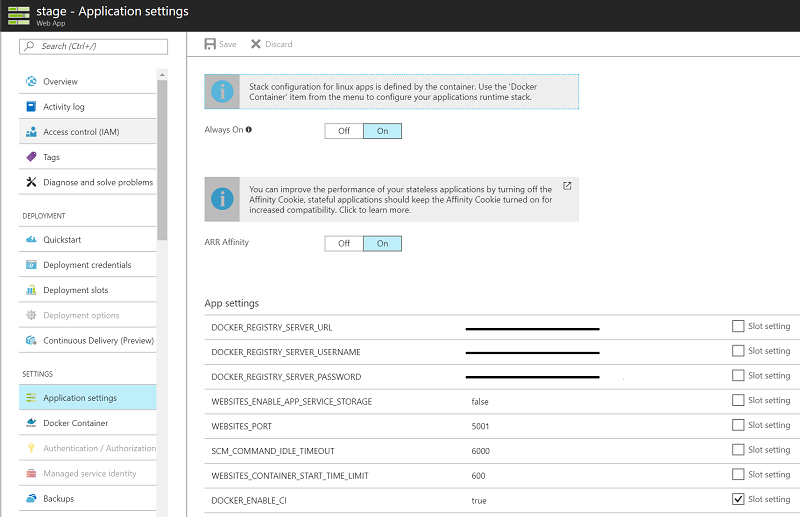

#### What customer consider for better performance

그러나, 이러한 모델 데이터는 앞으로도 계속해서 커질 가능성이 있으며, 이는 결국 언젠가는 올바로 로딩할 수 없는 상황을 초래하게 될 가능성이 높다. 더불어, 현재에도 배포와 SWAP 시 초기 로딩에 너무 많은 시간을 요구하는 것은 큰 문제이다. 해서, 이 이슈는 애플리케이션을 튜닝(혹은 개발 변경)하여 기술적으로 개선할 필요가 있다. 고객도 이러한 문제에 대해서 동의하였으며, 해결을 위한 기술적 고민을 시작할 것임을 시사했다. 

덧붙여, 현재 작성된 Dockerfile은 이미지 빌드 시에 필요한 Model 파일들을 모두 wget을 사용하여 로컬 경로로 복사한 뒤에, Model 파일을 포함한 채 이미지로 빌드하고 있다. 이는 고객이 사용하는 h5py 라이브러리가 로컬 경로의 파일만 로드할 수 있다는 제약이 있기 때문이다. 이 부분을 개선하여 Python에서 직접 Remote Location(Blob Storage)에 있는 h5 파일을 로드할 수 있도록 변경한다면, 혹은 다른 라이브러리를 사용해서 유사한 기능을 제공하도록 개선할 수 있다면 Docker 이미지 안에 모델 바이너리 파일을 포함시키지 않아도 되기에 빌드 이미지 크기와 Push에 소모되는 데이터 트래픽도 현저하게 줄일 수 있을 것이다. 

#### Customer Feedback

현재의 Web App for Container 플랫폼은 Deployment Slot 간에 Swap을 수행하는 데 너무 많은 시간이 걸린다. Production과 Stage 모두가 올바로 동작하는 것을 확인하고 Swap을 수행하는 경우에도(이미 두 Web App이 모두 운영 상황에 있음에도 불구하고) 새로운 이미지를 다시 로드하는 만큼의 시간이 걸린 뒤에 Swap이 수행된다. Swap에 많은 시간이 소요되는 문제는 Microsoft의 개발팀에서 개선해 줄 필요가 있다.

배포해야 하는 Deep Learning Model 의 크기 문제는 Embedding Layer 파일을 분리하고, Model 의 파일 포맷을 변경 및 online traing 부를 제외하고는 변수를 Freezing 하는 방식을 통하여, 1/3 정도로 Size 를 줄 일 수 있었으며, 해당 크기는 운영상에 지장이 없는 수준이었다. Tensorflow Serving 을 inference Layer에서 사용하지 않은 이유는 Keras Model 을 Tensorflow 용으로 Conversion 하는 수고를 덜고, gRPC디펜던시를 줄이고, online serving 과 동시에 training 이 가능한 환경을 구축하며, CNTK Backend 도 활용 가능한 모델을 만들기 위함이었다.

Flask 로 Deep Learning 을 서빙하는 경우 추가적으로 성능 튜닝이 필요한데, 이는 Flask 및 Python 의 특성에 기인한다. Production 상황에서 Flask Deep Learning Serving 의 성능을 10배 이상 끌어올리기 위해서는 Docker 내부에 nginx + flask + uwsgi 등의 추가적인 설정이 필요하며, 이는 Model 의 성격에 따라 다른 조합이 필요할 수도 있는 부분이다.

----------------------

### **Layer 3 : API Gateway(Chatbot App) Layer**

----------------------

#### As-Is

API Gateway는 사실상 ChatBot App의 역할이다. 채널 및 방 관리를 위해서는 SenBird를 활용하고 있다. SendBird의 WebHook을 통해서 봇 사용자가 물어오는 모든 챗은 이 서비스 Layer로 전달되며 처리된다. 기존에는 Python/Flask 기반으로 개발되어 있으며, 별도의 VM 상에서 운영 중에 있다(개발환경은 jupyter 노트북을 사용).

#### What customer want

고객은 이번 핵페스트를 통해서 챗봇의 서비스 환경을 IaaS가 아닌 Managed Service 환경으로 바꾸기를 희망했다. 그리고 가능하다면 기존의 서비스 로직을 분석해서 깔끔하게 로직을 재 정리하길 바랬으며, 동시에 서버리스 아키텍처가 적용되기를 희망했다. 고객이 생각하기에 서버리스 아키텍처가 적용되면 가장 효과적일 것으로 예상되는 Layer가 바로 이 Layer였기 때문이다. 서버리스를 적용하여 Layer를 좀 더 효율적이고 효과적으로 관리할 수 있기를 원했고, 개발자들이 챗봇의 개별 로직에만 집중하면서 서비스를 지속적으로 개선해 나갈 수 있기를 바랬다.

#### Analysis and Design

기존의 서비스 로직을 소스 수준에서 분석해 본 결과 다음과 같은 문제점들이 발견되었다.

문제점

- API 호출이 하나의 큰 동기적인 호출로 구성되어 있다.
- 모든 호출은 큰 메서드의 로직을 조건별로 수행하며 로직이 끝나기 전까지는 응답을 하지 않는다.
- 내부적으로 외부 API에 대한 호출이 수 차례 발생하며 그에 따라 분기를 반복하는 구조를 갖고 있다
- 세션 정보를 보관하기 위해서 Redis를 사용하고 있으며, 그를 지원하기 위한 코드 또한 직접 개발 및 관리하고 있다

기존의 로직을 개별적으로 모두 분석해 본 결과, 기존 Python 코드는 요청과 응답이 하나의 단일 Sync 호출로 이루어지는 구조였다. 또한, 내부에서 다양한 condition에 따라 분기하는 로직을 가지고 있었다. 즉, 모든 사용자의 입력은 intent 분석을 위해서 AI Serving Layer을 호출해야 하며, 호출 후에 얻어진 Intent에 따라서 그리고 다양한 조건에 따라서 로직이 분기되는 구조였다. 그렇기에, 상황에 따라 로직이 Skip되는 경우도 있고 상황에 따라서는 추가적으로 다른 API로의 외부 호출이 다시 발생하는 경우도 있었다. 외부 호출은 응답에 필요한 데이터를 추가적으로 얻기 위해서 타 부서에서 개발해 놓은 Web API를 호출하거나 Azure 상에 구축해놓은 QnA Maker 등을 호출하기 위해 발생한다.

더욱 안 좋은 점은 그러한 모든 처리가 논리적으로는 하나의 큰 단일 메서드 안에서 동기적으로 수행되는 비효율적인 구조였다는 것이다. 해서, 이러한 아키텍처 구조를 Async하게 변경하였으며, 그와 동시에 각각의 로직을 분리하여 서버리스 아키텍처로 혁신하였다. 각 로직 간의 통신은 메세지 큐를 통해서 진행하고 최종 응답 메세지는 비동기적으로 SendBird에 Proactive 방식의 메세지로 전송하도록 하였다.

그렇게 변경된 솔루션은 다음과 같다.

솔루션

- 가능한 한 모든 분기 로직은 개별 Function으로 분리한다
- 모든 호출은 비동기로 변경한다
- 사용자에 대한 응답도 비동기적으로 Proactive Massage를 통해서 응답한다
- 목적에 따라 다양한 큐를 활용하고 큐를 통해서 로직이 분기하도록 한다
  - 추후 부하가 높아지면 Event Hub로 대체할 수 있다
- 사용자의 상태는 Function의 Input/output Binding을 사용하여 Cosmos DB에 저장하도록 한다

그 결과 구성된 아키텍처는 다음과 같다.


#### Re-Design Control Flow and Logics

정의된 아키텍처에 따라 기존의 코드들을 분석하고 재작성이 가능한 지 여부를 점검했다. 고객은 가능하다면 Python을 사용하고 싶어했지만, 아직 Azure Function에서는 Python이 Experimental로만 지원되는 상황이기에 좀 더 안정적인 언어를 선택해야 했다. 결과적으로 고객은 모든 기존 코드를 C#으로 마이그레이션 하는 데에 동의하였고, 개발 언어와 플랫폼이 변경됨에 따라 기존 Python 코드와 제어 흐름을 모두 서버리스 아키텍처에 맞게 분해할 필요가 있었다.

고객사의 API Gateway 개발 담당자와 1일 동안 모든 로직을 분석하면서 Function 수준의 분리 작업을 수행하였고, 기존에 Redis로 보관하던 사용자의 상태 정보는 Cosmos DB를 사용하여 안정성과 가용성을 높이도록 하였다. 로직을 분리하고 정리하면서 아키텍처는 더욱 간소화되었고 불필요한 기존 코드도 깔끔하게 정리되었다.


이 과정으로 통해서 기존에 개발된 API Gateway 로직들을 Function으로 분리한 아키텍처는 다음과 같다.


분기 조건에 따라 서로 다른 큐로 메세지를 전달하고, 각각의 분기되는 로직은 해당 큐에 메세지가 오는 경우에만 수행하도록 변경하였다. 이는 기존의 로직에서 수 많은 if, else if를 남발했던 경우보다 직관적이며, 각각의 로직에만 집중해서 코드를 개선할 수 있다는 이점이 있다. 이러한 작업을 통해서 기존의 Flask, Python으로 작성되어 있던 로직은 C#, Function 으로 100% migration 되었다. 기존의 코드 예는 다음과 같다.

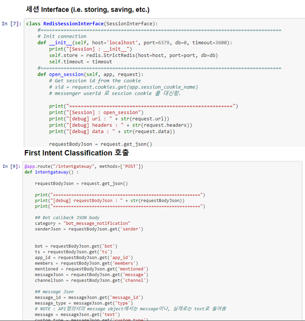

고객이 C#에 익숙하기 않기에 초기에는 약간의 우려가 있었으나, Function에서는 Trigger, Input, Output이 모두 Attribute로 간단하게 설정이 가능하기에 고객의 우려와는 달리 매우 쉽게 마이그레이션을 진행할 수 있었다. 고객의 예상에 어려울 것으로 추측했던 영역들(Queue 및 Cosmos DB 연계 코드들)이 단순히 어트리뷰트 설정만으로 연동되자 고객은 상당히 만족스러워했다. 그렇기에, 고객이 해야 할 일은 단지 업무 로직만을 C#으로 변경하면 되었으며, 약 2일 정도에 걸쳐 코드 이전 작업을 완료할 수 있었다. 마이그레이션 후 고객은 오히려 C#의 언어적인 멋진 기능들과 Visual Studio의 편리함에 만족스러워하였다. 실제로 사용된 코드의 예는 다음과 같다.

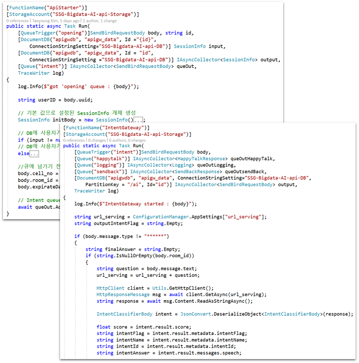

#### Performance

모든 코드를 서버리스 아키텍처 기반으로 분리한 뒤, 모의 테스트를 수행했을 때 결과는 만족스럽게도 2초 이내에 응답을 얻을 수 있었다. 사실상 가장 많은 시간이 소요되는 API Serving Layer를 호출하는 시간이 포함되었음에도 총 소요시간이 2초 이내로 나온 것은 만족스러운 결과였다.

또한, 각 Function 들의 수행시간을 살펴보기 위해서 Azure에서 제공하는 일종의 Application Performance Monitoring 도구인 Application Insight를 Function App에 적용하였다. 그렇기에, 이제 Chatbot App은 Application Insight를 통해서 모든 호출과 호출 빈도, 각 API의 실행 시간들을 실시간 모니터링 할 수 있게 되었다. 어떤 Function이 가장 많이 호출되고, 수행시간은 얼마나 걸리는지, 예외가 발생하는 경우 그 원인은 무엇인지 등을 각각의 Function 별로, 또한 실시간으로 살펴볼 수 있기에 디버깅 시에도 도움이 되며, 추후 개선해야 할 부분을 파악하는 데에도 도움이 된다.

현재 한국에서는 Consumption Plan이 지원되지 않고, 또한 고객도 초기에는 App Service Plan을 직접 조정하여 어느 수준의 비용 플랜이 적절한 지를 확인해 보고자 하기에 현재는 S1 크기의 플랜 하에서 Function App을 운영하고 있다. 추후 실제로 운영을 시작할 경우 및 사용자의 요청이 몰릴 경우에는 좀 더 높은 Plan을 사용할 예정이다.

#### Issues and Workaround

모든 개발 소스는 GitHub의 Private Repository와 통합되어야 하고 Web App의 Deployment Option 기능을 사용해서 자동 배포가 되도록 구성해야 했다. 하지만, 현재 Web App의 Deployment Option에서 제공하는 GitHub 통합 기능은 Public Repository만 지원하고 Private Repository는 지원하지 않는다. 그렇기에 이를 해결하기 위한 별도의 workaround가 필요했다. 이를 해결하려면 다음의 링크에서 제안하는 방법대로 약간의 메뉴얼적인 작업을 수행해야 한다.

Refer to https://nsamteladze.wordpress.com/2015/07/19/continuous-deployment-from-github-enterprise-repository-to-azure-web-app/

#### Customer Feedback

고객은 핵페스트 초기에 과연 기간 내에 코드 이전까지 포함하는 Migration이 가능할 지에 대해 약간 우려했었다. 하지만, Microsoft의 엔지니어와 함께 모든 로직을 분석하고 실제로 함께 코드 이전을 수행하여 기간 내에 완료할 수 있었기에 매우 깊은 감명을 받았다고 했다. Azure에서 제공하는 서버리스 기능들에 대해서도 매우 흡족해 하였다. 추가적으로 서버리스 아키텍처와 기술을 도입하니 인프라적인 코드나 플랫폼 기반 코드를 더이상 신경쓰지 않고 오로지 Business Logic에만 집중할 수 있어서 만족스럽다는 의견도 있었다.

----------------------

### Admin Management WebSite Layer

----------------------

#### As-Is

Admin Web Site는 관리자 전용 웹 사이트이다. 관리자는 Admin 웹사이트에서 다양한 Utterance를 입력하고, 각종 질의 관련 Rule을 등록하는 등 Intent, Entity와 연계된 다양한 관리 기능을 사용할 수 있다. 파악된 Intent에 따라 적절한 응답 메세지를 조합하거나, 개별 상황에 따른 응답 메시지를 관리하는 기능도 제공하고 있다. 또한, 관리자는 On-Demand 방식으로 Model Training을 즉각 수행하도록 명령을 실행할 수도 있다. 관리자 웹 사이트는 PHP로 개발되었으며, 다양한 CSS 및 Bootstrap UI들을 사용하여 화려한 UI를 제공하고 있다. 현재는 Azure VM에서 호스팅되고 있으며, 수동으로 소스 배포 및 관리되고 있다.

#### What customer want

고객은 다른 Layer들과 마찬가지로 Admin WebSite Layer도 별도의 VM에서 이를 관리하기 보다는 언제든지 Scale in/out이 가능한 PaaS 플랫폼을 적용하고자 했다. 다만, 현재 일부 클라이언트 라이브러리들이 다소 복잡하게 흩어져 있어서 Azure App Service로 이전하려면 기존의 구조를 단일 폴더의 하위로 통합하는 작업이 필요했다. 그렇기에, IaaS 환경에 맞춰 개발된 기존 소스 구조를 PaaS에서 매끄럽게 운영이 가능하도록 마이그레이션을 하길 희망했다. 또한, Github private에 커밋된 소스들이 즉각 Web App에 반영되기를 원했다.

또한, 데이터 저장소로 Maria DB를 사용하고 있는데, 이 부분을 MySQL on Azure로 변경하고 싶어했다. 하지만, 아직 MySQL on Azure은 Preview 상태이며, Korea Region에서 지원되지 않기에 이와 관련된 작업은 이번 핵페스트에서는 제외하기로 했다. (2018년 3월말 오픈 일주일을 앞두고 MySQL on Azure 가 GA 되었으며, Dev 형태로 사용하던 MySQL on Azure 를 Production 에 적용하여 Meta DB 또한 PaaS 를 사용하여 오픈 가능하였다.)

#### Analysis and Design 

현재는 일부 클라이언트 라이브러리들이 VM 로컬에 다소 복잡하게 흩어져 있고, 상대적인 경로로 매핑이 되어져 있기 때문에 Azure App Service로 이전하려면 기존의 흩어져있는 폴더 구조를 단일 폴더의 하위로 통합하는 작업이 필요하다. 그렇기에, 다운로드 되어 있는 수십 개의 클라언트 라이브러리 중에서 사용되는 것과 사용되지 않는 것들을 파악해서 사용하는 것들만 따로 모아서 정리하는 작업을 수행했다.

또한, 기존의 파일 업로드 기능도 App Service에서 올바로 동작하도록 코드 레벨에서의 수정이 필요했다. 기존에는 사용자들이 파일을 업로드하면 로컬 서버의 Temp 드라이브에 임시적으로 저장한 뒤, 서버 내 특정 위치로 이동시키는 방식으로 코드가 작성되어 있는데, 이를 Azure Storage에 통합하여 저장하도록 변경해야 한다.

그 밖에 PaaS를 도입할 경우 주의해야 할 사항들을 고객에게 전달하여 추가 개발 시에도 참고하도록 하였다. 참고 문서의 링크는 다음과 같다.

Web App을 Azure PaaS로 마이그레이션 할 경우 고려해야 할 사항들
https://github.com/taeyo/AzurePaaS/tree/master/ConsiderationWhileMigrateWebAppToAzure

Azure Web App으로 마이그레이션 시 참고할만한 구조적 예시
https://github.com/taeyo/AzurePaaS/tree/master/WebAppBasicArch

이를 반영하여 작성된 아키텍처는 다음과 같다.

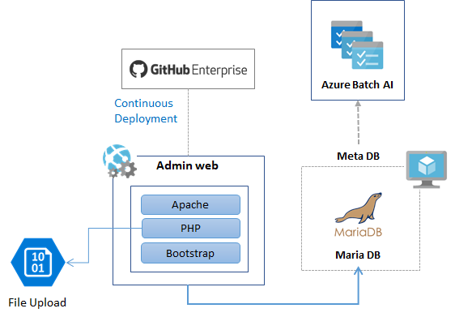

기존 코드를 Blob Storage를 사용하도록 변경된 소스 중 일부는 다음과 같다.

```php
<?php
...
use MicrosoftAzure\Storage\Common\ServicesBuilder;
use MicrosoftAzure\Storage\Blob\Models\CreateContainerOptions;
use MicrosoftAzure\Storage\Blob\Models\PublicAccessType;
use MicrosoftAzure\Storage\Common\ServiceException;

... 중략 ..

    $blobRestProxy = ServicesBuilder::getInstance()->createBlobService($connectionString);
    $pic = "ICO_".microtime(TRUE)."_".$_FILES['iconf']['name'];
    $pic_loc = $_FILES['iconf']['tmpName'];

    $folder = "/home/site/wwwroot/****/";
    $arrayValue = strtolower(array_pop( explode( '.', $pic )));

    if ( $arrayValue == "****" ) {
        if(move_uploaded_file($pic_loc,$folder.$pic) ) {
            //echo $folder.$pic;
            $image = $folder.$pic;
            $content = fopen($image,"r");
            $blob_name = $pic;
            try{
                $blobRestProxy->createBlockBlob("files", $blob_name, $content);
            }
            catch(ServiceException $e){
                $code = $e->getCode();
                ...
            }
```

그리고, 실제 운영중인 모습은 다음과 같다.

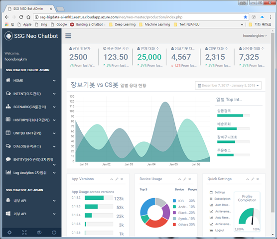

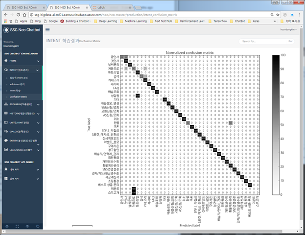

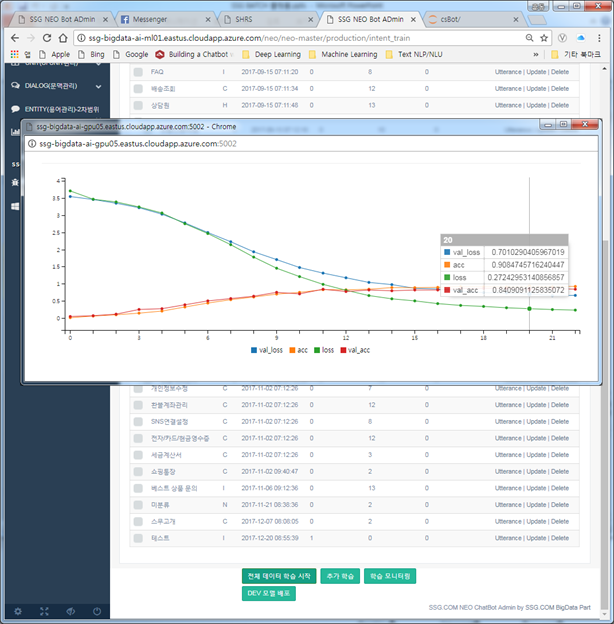

고객은 Migration 후에 다양한 테스트를 수행하여 문제가 발생할 가능성이 있는 부분을 보완해나가고 있으며 현재까지도 계속해서 기능을 추가 및 개선해 나가고 있다. 다음은 최근에도 코드 커밋이 수행되고 있는 Repo의 모습이다.

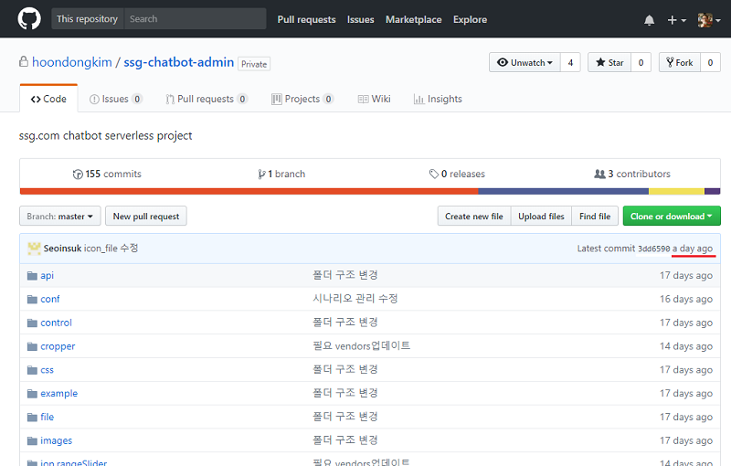

#### Issues and Workaround

다른 Layer와 마찬가지로 Admin 관리 웹사이트인 이 Layer도 GitHub의 Private Repository와 통합되어야 하고 Web App의 Deployment Option 기능을 사용해서 자동 배포가 되도록 구성해야 했다. 하지만, 앞서 언급했던 것과 마찬가지로 현재 Azure App Service는 Private Repository와 통합하기 위해서는 다소 우회적인 방법을 사용해야 한다. 이 이슈는 다음 링크를 참고하자. 

> 업데이트 : 오픈시점에는 Github가 VSTS로 이관되었다.

Refer to https://nsamteladze.wordpress.com/2015/07/19/continuous-deployment-from-github-enterprise-repository-to-azure-web-app/

----------------------
## Moments of the Hackfest

Envisioning Session

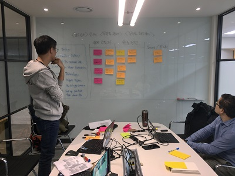| 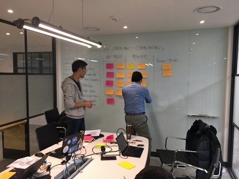
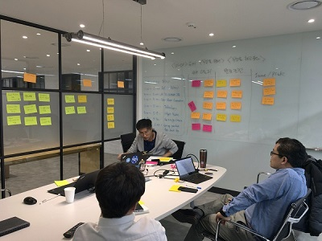| 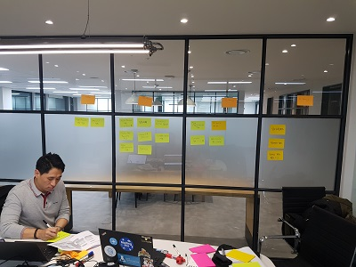

Hackfest

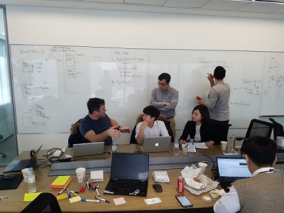 | 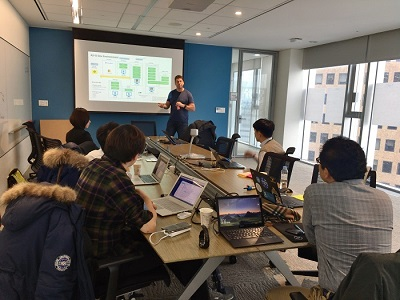
 | 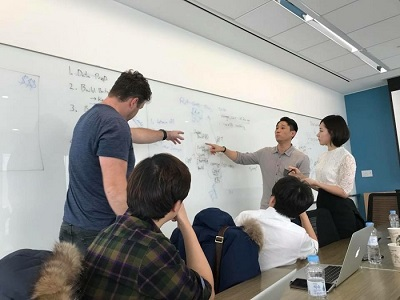
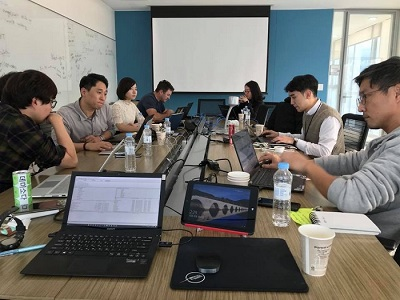 | 
 | 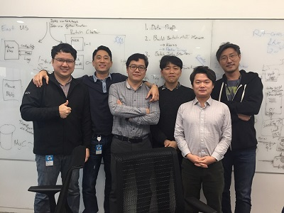

Video : SSG.COM Hackfest

[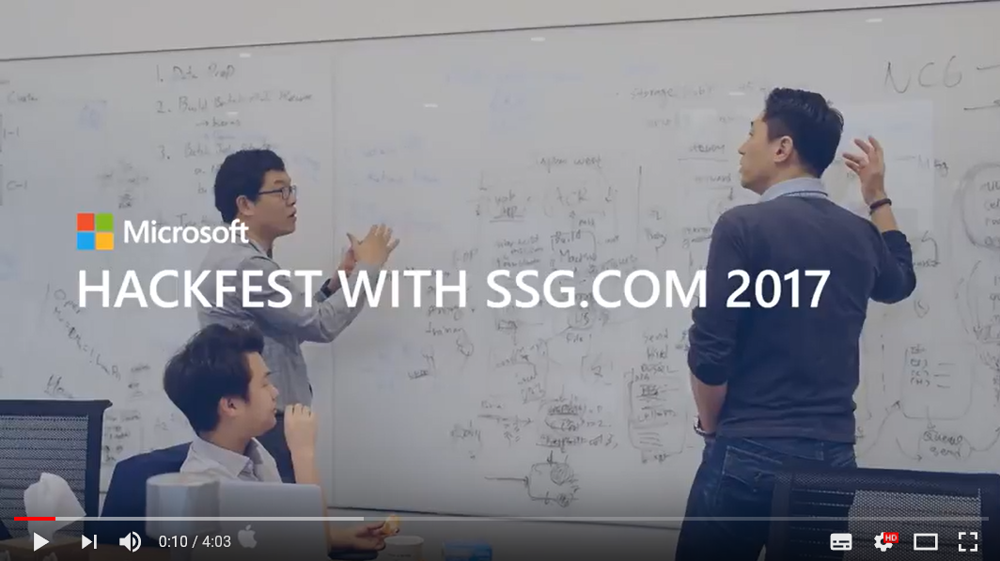](https://www.youtube.com/watch?v=Red-D5ChNzk)


## Business impact 
SSG.COM과 경쟁관계에 있는 많은 e-Commerce / 온라인 쇼핑몰 업체들은 이미 적극적으로 AI 기술을 자사의 서비스에 접목시키고 있다. 이에 대응하기 위해 신세계도 AI 기술에 많은 투자를 하고 있고 AI Bot 서비스를 시작으로 많은 AI 관련 서비스들이 출시될 계획에 있다. 신세계는 Serverless / PaaS 기반의 이번 플랫폼을 완성도 높게 구현함으로써 신규 서비스에 대한 Time-to-Market을 획기적으로 단축시킬 수 있는 경쟁력 있는 AI Bot 플랫폼을 갖추게 되었다. 

## Partner technical engagement feedback

다음은 이번 핵페스트에 참여한 SSG.COM 개발자들의 피드백이다.

> 저는 프로젝트를 리딩하는 입장에서, 기존 Web 프로젝트가 아닌 AI 프로젝트이기 때문에 경험하지 못했던, 이중화, 다중 사용자문제 해결, GPU 머신의 비용 문제 등의 문제를 PaaS 를 통하여 해결하고, Business Logic 에만 집중하고자 했습니다. 그리고, Deep Learning 트래이닝의 경우 GPU 리소스가 일시적으로만 많이 필요하고, 항상 필요한 것은 아닌 부분을 PaaS를 통해 효율적으로 리소스 활용했으면 했습니다. 뿐만 아니라, Auto Scale Out 기능이나 무중지 배포 등의 기능을 통해, 익숙치 않은 AI Service 에 있어서도 안전하고, 유연한 구성을 하고자 했습니다. 이번에 진행했던 HackFest 에서 원했던 부분의 모든 Solution 을 함께 구축해 볼 수 있었으며, 해당 경험을 프로덕션에까지 가지고갈 수 있어 매우 뜻깊은 경험이었습니다.
>
> 김훈동 Chief Lead, SSG AI Data Platform

> 저는 이번 핵페스트에서 AI Model Traning Layer를 Sub로 참여하였고, API Gateway Layer는 Main으로 맡아서 진행했습니다. 특히, 인상적인 부분은 API Gateway의 모든 기존의 Python 로직들을 분해해서 서버리스 기반으로 전면 재구성을 한 것입니다. 핵페스트 기간 내에 코드 마이그레이션까지 가능할 것이라고는 생각하지 못했는데, 실제로 끝내게 되다니 꽤나 놀라운 경험이었습니다. 덕분에 Azure에서 제공하는 서버리스 기술이 얼마나 편리한 지도 직접적으로 느껴볼 수 있었습니다. 기회가 있다면 한번 더 핵페스트에 참여해보고 싶습니다.
>
> 유성 dev,  SSG AI Data Platform

## Conclusion

### Our Impact

- 핵페스트 이후, SSG.COM의 AI Chatbot은 IaaS에서 PaaS로 플랫폼 혁신이 이루어졌으며 이러한 사례가 SSG.COM 내부적으로 공유되어 다른 여러 부서에서도 모범 사례로 평가받고 있다. 또한, 이러한 아키텍처는 타 부서에도 영향을 주고 있다.

- 핵페스트 이후, 김훈동 Lead는 지속적으로 Tensorflow, keras, CNTK, Horovod를 조합하여 Azure Batch AI에서 운영하는 다양한 테스트를 진행하고 있다. 그러면서, 서비스 Layer를 더욱 효율적으로 개선해 나가고 있다(전처리와 후처리를 기존 모듈에서 분리하여 더 효과적으로 개선하고 있다). 또한, 그가 경험한 기술적인 가치들을 자신의 블로그를 통해서 다른 데이터 전문가들과 지속적으로 공유하고 있다.

    https://www.facebook.com/kim.hoondong/posts/10214834432715314

    Deep Learning Multi Host & Multi GPU Architecture    
    Link : http://hoondongkim.blogspot.kr/2018/01/deep-learning-multi-host-multi-gpu.html
    
    Deep Learning Multi Host & Multi GPU 성능 비교 on Azure Batch AI( Tensorflow + Keras + Horovod + Azure Batch AI )
    Link : http://hoondongkim.blogspot.kr/2018/01/deep-learning-multi-host-multi-gpu_11.html

    심지어는, 이러한 내용을 단계별로 정리하여 다음과 같은 제목으로 개발자 커뮤니티와 함께 Hands-On Lab을 진행하기도 하였다.

    HOL : Deep Learning with Multi-GPU based on Azure Batch AI   
    FB Link : https://www.facebook.com/groups/krazure/permalink/1840871035955057/    
    Link : https://onoffmix.com/event/123844

- 핵페스트 이후, 관리자 웹 사이트는 하루에도 여러번 Commit 되고 지속적으로 Web App에 배포가 이루어지면서 기능적으로 개선되어 나가고 있다. 

### General lessons

AI Model Trainig 서비스를 Azure Batch AI에서 운영하는 것은 매우 훌륭한 선택이었다. 특히, CNTK나 Horovod를 활용하여 다양한 테스트들을 수행함으로써 SSG.COM의 AI 데이터 팀에게 맞는 최적의 아키텍처를 얻어낼 수 있었다. 

AI Inference Layer에 Container 기술을 접목시킨 것도 매우 좋은 시도였다. 이번 핵페스트를 준비하면서 막연하게 GPU에 의존했던 기존 방식들이 과연 의미가 있는지를 새로운 시각으로 점검해 볼 수 있었다. 그리고, 여러 검증을 통해서 비용적으로도, 기술적으로도 개선된 아키텍처를 확보할 수 있었다. 특히, Azure Web App에 컨테이너 기술을 접목하는 구성은 상당히 효과적이었다. 

ChatBot App을 완전히 서버리스 아키텍처로 마이그레이션한 것도 큰 성과였다. 개발자는 이제 개별 로직에만 집중할 수 있게 되었으며, 다양한 외부 서비스들(상태 서버, 데이터베이스, 큐 등)을 이용하는 부분에 있어 적은 노력으로 큰 효과를 누릴 수 있게 되었다. 이렇게 기술에 대한 신뢰가 쌓임으로써 고객은 차기 버전에서는 Microsoft Bot Framework를 활용하는 것도 고려하고 있다.